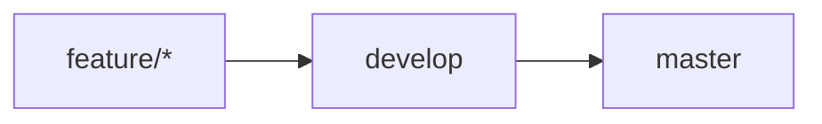

# 📘 Workflow Oficial del Proyecto

## 🎯 Objetivo
Trabajar de forma ordenada, profesional y colaborativa para evitar:

- Conflictos grandes
- Pérdida de cambios
- Código mezclado sin revisión
- Push directos peligrosos a producción

---

## 🌳 Estructura de ramas

| Rama | Propósito |
|---|---|
| `master` | Producción (código estable) |
| `develop` | Integración (código en desarrollo) |

Las demás ramas son **temporales** y se eliminan después del merge.

---

## 🔒 Reglas importantes

- ❌ No hacer push directo a `master`
- ❌ No hacer push directo a `develop`
- ✅ Todo cambio debe pasar por Pull Request
- ✅ Toda feature se trabaja en una rama temporal
- ✅ Las ramas temporales se eliminan después del merge

---

## 🌿 Flujo de trabajo (paso a paso)

### 1. Crear una nueva funcionalidad
Siempre partir desde `develop`:

```bash
git checkout develop
git pull origin develop
git checkout -b feature/nombre-de-la-funcionalidad
```

Ejemplo:

```bash
git checkout -b feature/login-api
```

### 2. Trabajar normalmente
Hacer commits claros:

```bash
git add .
git commit -m "feat: add login endpoint"
```

### 3. Antes de subir el PR (muy importante)
Actualizar la rama con los últimos cambios de `develop`:

```bash
git fetch origin
git merge origin/develop
```

Si hay conflictos:

1. Resolverlos
2. Hacer commit
3. Continuar

Esto evita conflictos grandes en el Pull Request.

### 4. Subir la rama

```bash
git push origin feature/login-api
```

### 5. Crear Pull Request
Destino:

```text
feature/login-api → develop
```

Checklist de cierre:

- [ ] Revisión del otro miembro
- [ ] Aprobación
- [ ] Merge
- [ ] Eliminación de rama temporal

---

## 🚀 Pasar cambios a producción
Cuando `develop` esté estable, crear Pull Request:

```text
develop → master
```

Eso representa una nueva versión estable del sistema.

Opcionalmente, crear versión:

```bash
git tag v1.0.0
git push origin v1.0.0
```

---

## 📌 Convención de nombres de ramas

Ejemplos válidos:

- `feature/login`
- `feature/register`
- `fix/token-expiration`
- `refactor/auth-service`

Las ramas deben representar **funcionalidades**, no personas.

---

## ⚠️ Por qué NO usamos ramas personales
No usar ramas como:

- `juan`
- `pedro`

Problemas que generan:

- Acumulan cambios mezclados
- Generan PRs enormes
- Aumentan conflictos
- Dificultan revisión
- Se pierde trazabilidad

Las ramas deben representar trabajo específico, no propietarios.

---

## 🧠 Regla clave
Si una feature dura más de 1 día, actualizarla contra `develop` antes de seguir trabajando.

Esto mantiene el proyecto sincronizado y evita conflictos grandes.

---

## 📦 Resumen visual del flujo

```text
feature/* → develop → master
```



Siempre en ese orden.

---

## ✅ Objetivo final
Este flujo:

- Mantiene el proyecto organizado
- Reduce conflictos
- Mejora la revisión de código
- Permite escalar el equipo en el futuro
- Protege la rama de producción
